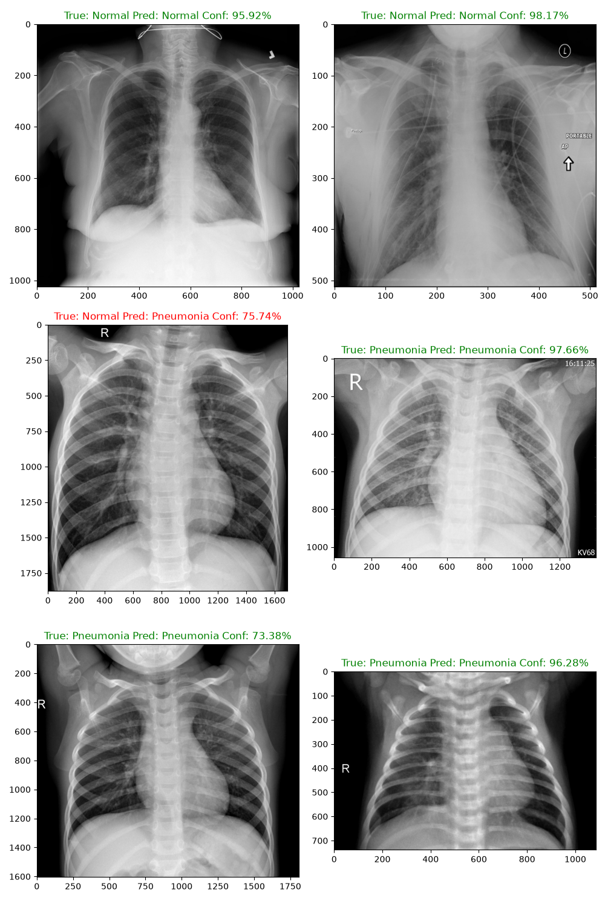
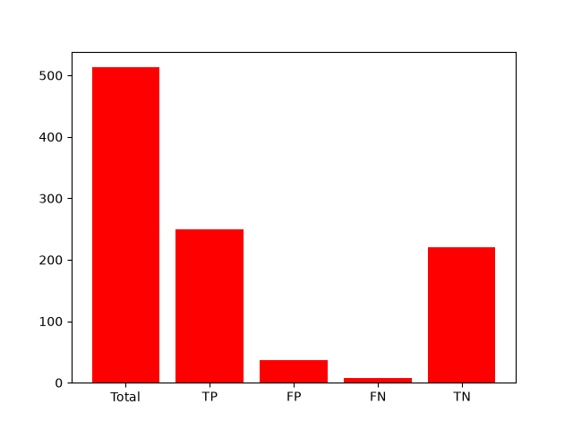
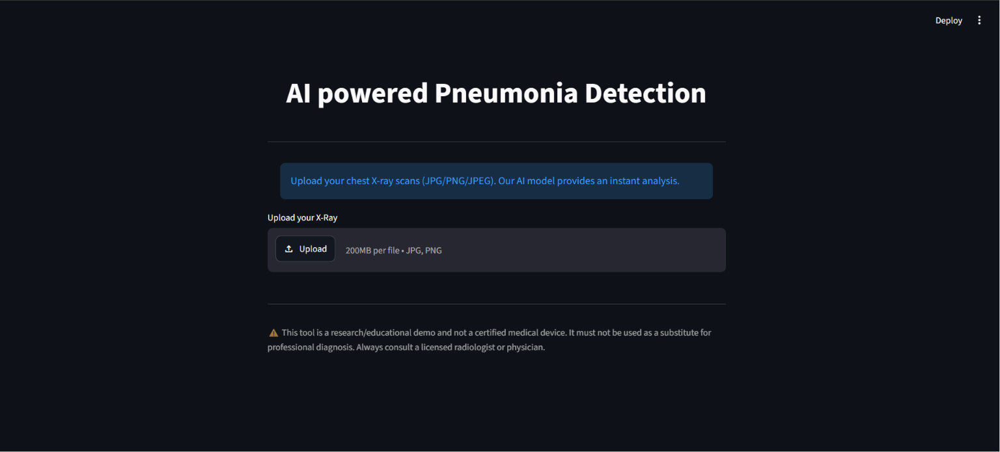

# AI-Powered Pneumonia Detection

### Real-Time Chest X-Ray Classification Using a Custom Convolutional Neural Network 

[](https://www.python.org/)
[](https://pytorch.org/)
[](https://streamlit.io/)
[](LICENSE)

---

## Overview

Pneumonia remains one of the leading causes of mortality worldwide, particularly among children under five and immunocompromised adults. Timely and accurate diagnosis from chest radiographs is critical for effective clinical intervention, yet access to trained radiologists is severely limited in many regions. Automated screening tools that can flag suspicious X-rays in seconds have the potential to close this diagnostic gap, enabling frontline healthcare workers to prioritize high-risk patients.

This project presents a **lightweight, end-to-end deep learning pipeline** for binary classification of chest X-ray images into **Normal** and **Pneumonia** categories. The model is a custom 6-layer Convolutional Neural Network built entirely with PyTorch's `nn.Sequential` API — no transfer learning, no pretrained backbone — designed to demonstrate that a compact, purpose-built architecture can achieve clinically meaningful performance on a well-curated radiographic dataset.

The inference pipeline is deployed as an interactive web application using **Streamlit**, allowing users to upload a chest X-ray scan (JPG/PNG/JPEG) and receive an instant prediction with an associated confidence score. The entire workflow — from image preprocessing to model inference to result rendering — executes in real time.


<div align="center">

App Deployed at [link](https://ai-healthcare-pneumonia-detection.streamlit.app/)

</div>


## Key Features

| Feature | Description |
|:---|:---|
| **Real-Time Inference** | Upload a chest X-ray and receive a classification (Normal / Pneumonia) with confidence in seconds. |
| **Custom CNN Architecture** | A purpose-built 6-layer convolutional network — no pretrained weights or transfer learning. |
| **Streamlit Web Interface** | Clean, intuitive single-page UI with status indicators, progress spinners, and centered layout. |
| **File Validation** | Enforces a **10 MB** upload limit and restricts input to `JPG`, `PNG`, and `JPEG` formats. |
| **GPU Acceleration** | Automatic CUDA detection; falls back to CPU seamlessly when a GPU is unavailable. |
| **Cached Model Loading** | Uses `@st.cache_resource` to load the model once and serve subsequent requests instantly. |
| **Optimized Threshold** | Inference threshold tuned via Precision-Recall curve analysis on the test set for optimal F1. |


## Model Architecture

The classifier is a fully convolutional `nn.Sequential` network with **6 convolutional blocks**, followed by adaptive pooling and flattening for binary output.

```
Input: 1 × 128 × 128 (Grayscale Chest X-Ray)

┌─────────────────────────────────────────────────┐
│  Conv2d(1→4, k=3, s=2) → BatchNorm2d → Tanh()   │  Block 1
│  Conv2d(4→16, k=3, s=2) → BatchNorm2d → Tanh()  │  Block 2
│  Conv2d(16→64, k=3, s=2) → BatchNorm2d → Tanh() │  Block 3
│  Conv2d(64→16, k=3, s=2) → BatchNorm2d → Tanh() │  Block 4
│  Conv2d(16→4, k=3, s=2) → BatchNorm2d → Tanh()  │  Block 5
│  Conv2d(4→1, k=3, s=2) → BatchNorm2d            │  Block 6
│  AdaptiveAvgPool2d(1×1) → Flatten()             │  Output
└─────────────────────────────────────────────────┘

Output: 1 (raw logit → Sigmoid → probability)
```

| Hyperparameter | Value |
|:---|:---|
| **Optimizer** | Adam (`lr = 0.001`) |
| **Loss Function** | `BCEWithLogitsLoss` |
| **LR Scheduler** | `ReduceLROnPlateau` (monitors validation loss) |
| **Epochs** | 30 |
| **Batch Size** | 8 |
| **Decision Threshold (Train)** | 0.8 |
| **Decision Threshold (Inference)** | 0.4 (tuned via Precision-Recall analysis) |
| **Data Augmentation** | `RandomRotation(10°)`, `RandomAffine(translate=5%)` |

> **Note:** All convolutional layers use `bias=False` since each is immediately followed by `BatchNorm2d`, which incorporates its own learnable bias.

---

##  Performance
| Metric | Value |
|:---|:---|
| **Test Accuracy** | `91.62%` |
| **Best F1 Score** | `0.9225` |
| **Optimal Threshold** | `0.4656` |
| **True Positives** | `249` |
| **True Negatives** | `221` |
| **False Positives** | `36` |
| **False Negatives** | `7` |

<div align="center">

| Sample Predictions | Prediction Metrics |
|:---:|:---:|
|  |  |

</div>

---

## Dataset

This project uses the **"A Primary Chest X-ray Dataset of Normal and Pneumonia Cases from Epic Chittagong, Bangladesh"** dataset, organized into `Training/` and `Testing/` splits, each containing `normal/` and `pneumonia/` subdirectories.

- **Source:** [https://data.mendeley.com/datasets/wndbd5r26y/3]
- **Format:** Variable-resolution JPEG/PNG chest radiographs, resized to `128×128` grayscale during preprocessing.
- **Split Strategy:** 80/20 train/validation split (programmatic, from the `Training/` folder); a separate `Testing/` folder is used for final evaluation.

> Images are of varying resolutions and are normalized to a uniform `128×128` grayscale tensor via `torchvision.transforms`.

---

## Installation & Setup

### Prerequisites

- Python **3.10+**
- `pip` package manager
- (Optional) NVIDIA GPU with CUDA for accelerated inference

### Steps

```bash
# 1. Clone the repository
git clone https://github.com/aakarroy/Pneumonia-Detection.git
cd Pneumonia-Detection

# 2. Create and activate a virtual environment
python -m venv venv

# Windows
venv\Scripts\activate

# macOS / Linux
source venv/bin/activate

# 3. Install dependencies
pip install -r requirements.txt
```
### Download the Dataset

1. Download the chest X-ray dataset from [https://data.mendeley.com/datasets/wndbd5r26y/3].
2. Extract it into the project root so the structure matches:
   ```
   Pneumonia-Detection/
   └── Dataset-of-Normal-and-Pneumo/
       ├── Training/
       │   ├── normal/
       │   └── pneumonia/
       └── Testing/
           ├── normal/
           └── pneumonia/
   ```

---

##  Usage

### Launch the Streamlit Application

```bash
streamlit run streamlit.py
```

The application will open in your default browser (typically at `http://localhost:8501`).

### How to Interact

1. **Upload** a chest X-ray image (`.jpg`, `.png`, or `.jpeg`, ≤ 10 MB).
2. The AI model will **preprocess** the image (grayscale conversion, resize to 128×128).
3. View the **prediction** (Normal / Pneumonia) alongside the **confidence score**.

<div align="center">



</div>

### Training the Model (Optional)

To retrain the model from scratch:

```bash
python main.py
```

The best-performing checkpoint will be saved as `Best-Pnemonia-03.pth`.

### Evaluating & Visualizing Results

To run the full test-set evaluation, compute the optimal threshold, and generate prediction plots:

```bash
python visual.py
```

This script outputs:
- **Optimal threshold** and **F1 score** via Precision-Recall curve analysis.
- **Confusion matrix bar chart** → `Predictions-Metrics.png`
- **Sample prediction grid** (3 Normal + 3 Pneumonia) → `Prediction.png`

---

---

## Future Scope

- **Cloud Deployment** — Containerize with Docker and deploy to AWS / GCP / Azure for public access.
- **Grad-CAM Explainability** — Integrate Gradient-weighted Class Activation Mapping to highlight the lung regions driving each prediction, improving clinical trust and interpretability.
- **Expand Disease Coverage** — Extend the classifier to detect tuberculosis, lung cancer nodules, COVID-19, and other pulmonary conditions.
- **Transfer Learning** — Benchmark against pretrained architectures (ResNet-18, EfficientNet-B0, DenseNet-121) to compare performance vs. the custom CNN.
- **Enhanced Metrics Dashboard** — Display ROC curves, Precision-Recall curves, and per-class metrics directly within the Streamlit UI.
- **DICOM Support** — Accept standard medical imaging formats (`.dcm`) in addition to JPG/PNG.
- **Mobile-Responsive UI** — Optimize the Streamlit layout for tablet and mobile use in field settings.
- **HIPAA-Aware Pipeline** — Implement on-device inference and data handling policies compliant with healthcare data regulations.

---

## Author & Acknowledgments

**Developed by [Aakar Roy](https://github.com/aakarroy)**

- Dataset: *AA Primary Chest X-ray Dataset of Normal and Pneumonia Cases from Epic Chittagong, Bangladesh* — [link](https://data.mendeley.com/datasets/wndbd5r26y/3)
- Framework: [PyTorch](https://pytorch.org/) · [Streamlit](https://streamlit.io/)
    
---

> **⚠️ Disclaimer**
>
> This application is an **educational and research demonstration** only. It is **not** a certified medical device and must **not** be used as a substitute for professional medical diagnosis. Chest X-ray interpretation should always be performed by a licensed radiologist or physician. The developer assumes no liability for clinical decisions made based on this tool's output.

